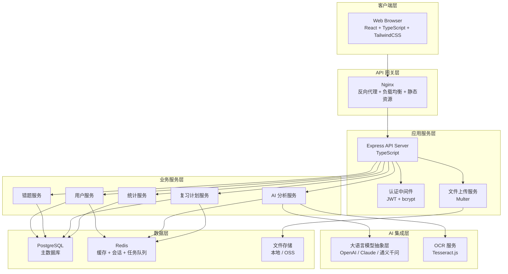
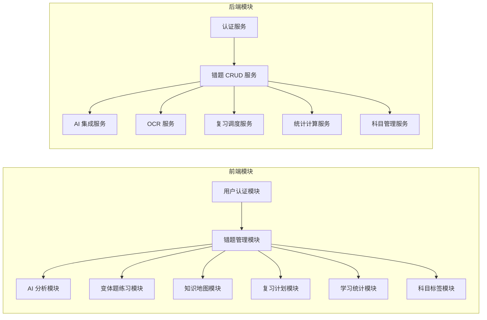

# 系统架构设计文档

> 错题猎人 (Mistake Hunter) | 版本：v1.0 | 日期：2026-05-30

---

## 一、系统架构概述



---

## 二、技术栈选型

| 层 | 技术 | 选型理由 |
|----|------|----------|
| 前端框架 | React 18 + TypeScript | 生态成熟、类型安全、组件化开发 |
| 前端样式 | TailwindCSS | 原子化 CSS、响应式设计、深色模式支持 |
| 前端路由 | React Router v6 | SPA 路由管理 |
| 前端状态 | Zustand | 轻量级状态管理，比 Redux 简洁 |
| 前端图表 | Recharts | React 生态最流行的图表库 |
| 前端数学 | KaTeX | 高性能数学公式渲染 |
| 后端框架 | Express + TypeScript | 灵活、中间件生态丰富 |
| 数据库 | PostgreSQL 15 | 关系型数据、JSON 支持、全文搜索 |
| 缓存 | Redis 7 | 会话管理、热点数据缓存、任务队列 |
| ORM | Prisma | 类型安全的数据库访问、自动迁移 |
| 认证 | JWT + bcrypt | 无状态认证 + 安全密码存储 |
| OCR | Tesseract.js | 免费、本地运行、隐私安全 |
| AI 模型 | 可插拔抽象层 | 支持 OpenAI / Claude / 国产模型切换 |
| 文件上传 | Multer + 本地存储 | V1 简单方案，后续可迁移 OSS |
| 测试 | Vitest + Supertest | 单元测试 + API 集成测试 |
| 包管理 | pnpm | 快速、节省磁盘空间 |

---

## 三、目录结构

```
mistake-hunter/
├── src/                          # 前端源码
│   ├── components/               # 通用组件
│   │   ├── ui/                   # 基础 UI 组件（Button, Input, Modal...）
│   │   ├── layout/               # 布局组件（Header, Sidebar, Footer）
│   │   └── common/               # 业务通用组件（ErrorBoundary, Loading...）
│   ├── pages/                    # 页面组件
│   │   ├── auth/                 # 登录/注册
│   │   ├── dashboard/            # 首页仪表盘
│   │   ├── mistakes/             # 错题管理
│   │   ├── review/               # 复习计划
│   │   ├── knowledge-map/        # 知识地图
│   │   └── statistics/           # 学习统计
│   ├── stores/                   # Zustand 状态管理
│   ├── services/                 # API 调用服务层
│   ├── hooks/                    # 自定义 Hooks
│   ├── types/                    # TypeScript 类型定义
│   ├── utils/                    # 工具函数
│   └── styles/                   # 全局样式 + TailwindCSS 配置
├── server/                       # 后端源码
│   ├── src/
│   │   ├── controllers/          # 路由控制器
│   │   ├── services/             # 业务逻辑层
│   │   ├── middlewares/          # 中间件（auth, validation, error handler）
│   │   ├── routes/               # 路由定义
│   │   ├── prisma/               # Prisma schema + migrations
│   │   ├── config/               # 配置文件
│   │   └── utils/                # 工具函数（AI, OCR, logger）
│   ├── uploads/                  # 上传文件存储目录
│   └── tests/                    # 后端测试
├── docs/                         # 项目文档
│   ├── prd/                      # 产品需求文档
│   ├── architecture/             # 架构设计文档
│   ├── design/                   # UI/UX 设计文档
│   └── database/                 # 数据库设计文档
├── package.json
├── tsconfig.json
├── .env.example
└── README.md
```

---

## 四、API 接口规范 (OpenAPI 3.0 摘要)

### 4.1 认证模块

| 方法 | 路径 | 说明 | 认证 |
|------|------|------|------|
| POST | `/api/auth/register` | 用户注册 | 否 |
| POST | `/api/auth/login` | 用户登录 | 否 |
| POST | `/api/auth/refresh` | 刷新 Token | 是 |
| GET | `/api/auth/me` | 获取当前用户信息 | 是 |
| PUT | `/api/auth/profile` | 更新个人信息 | 是 |

### 4.2 错题模块

| 方法 | 路径 | 说明 | 认证 |
|------|------|------|------|
| POST | `/api/mistakes` | 创建错题（手动/OCR） | 是 |
| GET | `/api/mistakes` | 错题列表（分页+筛选+搜索） | 是 |
| GET | `/api/mistakes/:id` | 错题详情 | 是 |
| PUT | `/api/mistakes/:id` | 更新错题 | 是 |
| DELETE | `/api/mistakes/:id` | 删除错题 | 是 |
| POST | `/api/mistakes/batch-delete` | 批量删除 | 是 |
| POST | `/api/mistakes/:id/analyze` | AI 错因分析 | 是 |
| POST | `/api/mistakes/:id/variants` | 生成变体题 | 是 |
| POST | `/api/mistakes/:id/mark-mastered` | 标记已掌握 | 是 |

### 4.3 变体题模块

| 方法 | 路径 | 说明 | 认证 |
|------|------|------|------|
| GET | `/api/variants/:id` | 变体题详情 | 是 |
| POST | `/api/variants/:id/answer` | 提交变体题答案 | 是 |
| GET | `/api/mistakes/:id/variants` | 获取错题的变体题列表 | 是 |

### 4.4 科目模块

| 方法 | 路径 | 说明 | 认证 |
|------|------|------|------|
| GET | `/api/subjects` | 科目列表 | 是 |
| POST | `/api/subjects` | 创建科目 | 是 |
| PUT | `/api/subjects/:id` | 更新科目 | 是 |
| DELETE | `/api/subjects/:id` | 删除科目 | 是 |
| GET | `/api/subjects/:id/chapters` | 获取章节列表 | 是 |
| POST | `/api/subjects/:id/chapters` | 创建章节 | 是 |

### 4.5 标签模块

| 方法 | 路径 | 说明 | 认证 |
|------|------|------|------|
| GET | `/api/tags` | 标签列表 | 是 |
| POST | `/api/tags` | 创建标签 | 是 |
| PUT | `/api/tags/:id` | 更新标签 | 是 |
| DELETE | `/api/tags/:id` | 删除标签 | 是 |

### 4.6 复习计划模块

| 方法 | 路径 | 说明 | 认证 |
|------|------|------|------|
| GET | `/api/review/today` | 获取今日复习任务 | 是 |
| POST | `/api/review/:id/complete` | 完成复习任务 | 是 |
| GET | `/api/review/schedule` | 获取复习日历 | 是 |

### 4.7 统计模块

| 方法 | 路径 | 说明 | 认证 |
|------|------|------|------|
| GET | `/api/stats/summary` | 今日摘要 | 是 |
| GET | `/api/stats/trend` | 进步趋势 | 是 |
| GET | `/api/stats/error-types` | 错因分布 | 是 |
| GET | `/api/stats/knowledge-weakness` | 知识薄弱点 | 是 |

### 4.8 OCR 模块

| 方法 | 路径 | 说明 | 认证 |
|------|------|------|------|
| POST | `/api/ocr/recognize` | 图片 OCR 识别 | 是 |

---

## 五、模块划分



---

## 六、非功能性设计

### 6.1 安全设计

| 层面 | 措施 |
|------|------|
| 认证 | JWT Token，有效期 2 小时，Refresh Token 7 天 |
| 密码 | bcrypt 加密，salt rounds = 12 |
| API | 输入校验（express-validator），请求限流（express-rate-limit） |
| 数据库 | 参数化查询（Prisma 自动），防止 SQL 注入 |
| 文件上传 | 文件类型白名单（jpg/png/jpeg），大小限制 10MB |
| CORS | 仅允许指定域名 |
| 敏感信息 | .env 文件管理，不提交到 Git |

### 6.2 性能设计

| 策略 | 说明 |
|------|------|
| 数据库索引 | 用户 ID、科目 ID、创建时间等高频查询字段建索引 |
| Redis 缓存 | 科目列表、用户信息等热点数据缓存 |
| 分页查询 | 列表接口统一支持分页，默认每页 20 条 |
| 前端懒加载 | 路由级别代码分割，按需加载 |
| 图片压缩 | 上传图片自动压缩 + 生成缩略图 |

### 6.3 可扩展性

| 设计 | 说明 |
|------|------|
| AI 模型抽象层 | 统一接口，支持 OpenAI / Claude / 国产模型热切换 |
| OCR 服务抽象 | 支持 Tesseract.js 本地识别 / 百度 OCR API 切换 |
| 文件存储抽象 | V1 本地存储，后续可切换 OSS / S3 |
