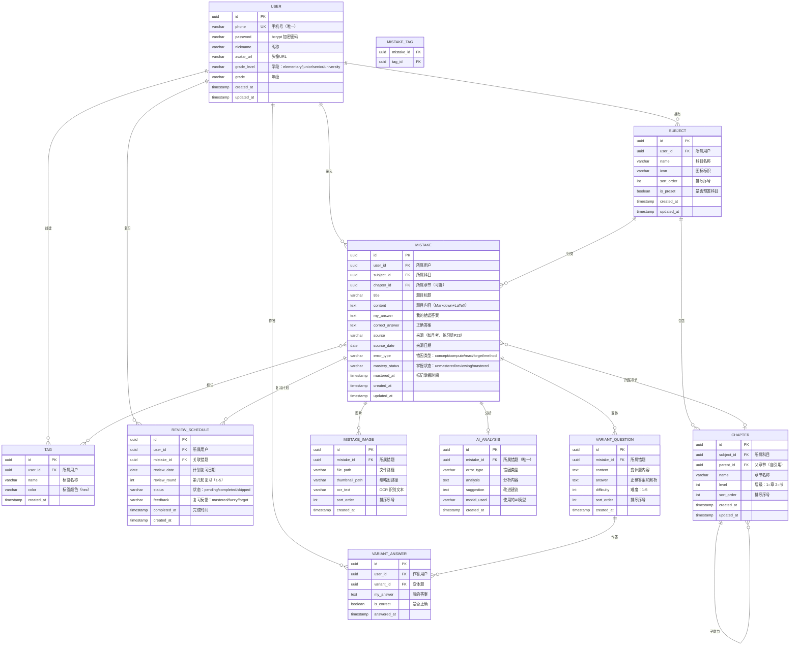

# 数据库设计文档

> 错题猎人 (Mistake Hunter) | 版本：v1.0 | 日期：2026-05-30

---

## 一、ER 图



---

## 二、表结构定义

### 2.1 users 用户表

| 字段 | 类型 | 约束 | 说明 |
|------|------|------|------|
| id | UUID | PK, DEFAULT uuid_generate_v4() | 主键 |
| phone | VARCHAR(20) | UNIQUE, NOT NULL | 手机号 |
| password | VARCHAR(255) | NOT NULL | bcrypt 加密密码 |
| nickname | VARCHAR(50) | NOT NULL | 昵称 |
| avatar_url | VARCHAR(500) | NULL | 头像URL |
| grade_level | VARCHAR(20) | NOT NULL, DEFAULT 'junior' | 学段 |
| grade | VARCHAR(20) | NULL | 年级 |
| created_at | TIMESTAMP | NOT NULL, DEFAULT NOW() | 创建时间 |
| updated_at | TIMESTAMP | NOT NULL, DEFAULT NOW() | 更新时间 |

### 2.2 subjects 科目表

| 字段 | 类型 | 约束 | 说明 |
|------|------|------|------|
| id | UUID | PK | 主键 |
| user_id | UUID | FK → users.id, NOT NULL | 所属用户 |
| name | VARCHAR(50) | NOT NULL | 科目名称 |
| icon | VARCHAR(50) | DEFAULT '📚' | 图标 |
| sort_order | INT | DEFAULT 0 | 排序 |
| is_preset | BOOLEAN | DEFAULT false | 是否预置 |
| created_at | TIMESTAMP | DEFAULT NOW() | |
| updated_at | TIMESTAMP | DEFAULT NOW() | |

### 2.3 chapters 章节表

| 字段 | 类型 | 约束 | 说明 |
|------|------|------|------|
| id | UUID | PK | 主键 |
| subject_id | UUID | FK → subjects.id, NOT NULL | 所属科目 |
| parent_id | UUID | FK → chapters.id, NULL | 父章节（一级为NULL） |
| name | VARCHAR(100) | NOT NULL | 章节名称 |
| level | INT | NOT NULL, DEFAULT 1 | 层级 1或2 |
| sort_order | INT | DEFAULT 0 | 排序 |
| created_at | TIMESTAMP | DEFAULT NOW() | |
| updated_at | TIMESTAMP | DEFAULT NOW() | |

### 2.4 tags 标签表

| 字段 | 类型 | 约束 | 说明 |
|------|------|------|------|
| id | UUID | PK | 主键 |
| user_id | UUID | FK → users.id, NOT NULL | 所属用户 |
| name | VARCHAR(30) | NOT NULL | 标签名称 |
| color | VARCHAR(7) | DEFAULT '#3b82f6' | 颜色值 |
| created_at | TIMESTAMP | DEFAULT NOW() | |

### 2.5 mistakes 错题表

| 字段 | 类型 | 约束 | 说明 |
|------|------|------|------|
| id | UUID | PK | 主键 |
| user_id | UUID | FK → users.id, NOT NULL | 所属用户 |
| subject_id | UUID | FK → subjects.id, NOT NULL | 所属科目 |
| chapter_id | UUID | FK → chapters.id, NULL | 所属章节 |
| title | VARCHAR(200) | NOT NULL | 题目标题 |
| content | TEXT | NOT NULL | 题目内容 |
| my_answer | TEXT | NULL | 我的错误答案 |
| correct_answer | TEXT | NULL | 正确答案 |
| source | VARCHAR(100) | NULL | 来源 |
| source_date | DATE | NULL | 来源日期 |
| error_type | VARCHAR(20) | NULL | 错因类型 |
| mastery_status | VARCHAR(20) | DEFAULT 'unmastered' | 掌握状态 |
| mastered_at | TIMESTAMP | NULL | 掌握时间 |
| created_at | TIMESTAMP | DEFAULT NOW() | |
| updated_at | TIMESTAMP | DEFAULT NOW() | |

### 2.6 mistake_images 错题图片表

| 字段 | 类型 | 约束 | 说明 |
|------|------|------|------|
| id | UUID | PK | 主键 |
| mistake_id | UUID | FK → mistakes.id, NOT NULL, ON DELETE CASCADE | 所属错题 |
| file_path | VARCHAR(500) | NOT NULL | 文件路径 |
| thumbnail_path | VARCHAR(500) | NULL | 缩略图路径 |
| ocr_text | TEXT | NULL | OCR 识别文本 |
| sort_order | INT | DEFAULT 0 | 排序 |
| created_at | TIMESTAMP | DEFAULT NOW() | |

### 2.7 mistake_tags 错题标签关联表

| 字段 | 类型 | 约束 | 说明 |
|------|------|------|------|
| mistake_id | UUID | FK → mistakes.id, ON DELETE CASCADE | 错题ID |
| tag_id | UUID | FK → tags.id, ON DELETE CASCADE | 标签ID |
| **PK** | | (mistake_id, tag_id) | 联合主键 |

### 2.8 ai_analyses AI 分析表

| 字段 | 类型 | 约束 | 说明 |
|------|------|------|------|
| id | UUID | PK | 主键 |
| mistake_id | UUID | FK → mistakes.id, UNIQUE, NOT NULL | 所属错题（一对一） |
| error_type | VARCHAR(20) | NOT NULL | 错因类型 |
| analysis | TEXT | NOT NULL | 分析内容 |
| suggestion | TEXT | NULL | 改进建议 |
| model_used | VARCHAR(50) | NOT NULL | AI 模型标识 |
| created_at | TIMESTAMP | DEFAULT NOW() | |

### 2.9 variant_questions 变体题表

| 字段 | 类型 | 约束 | 说明 |
|------|------|------|------|
| id | UUID | PK | 主键 |
| mistake_id | UUID | FK → mistakes.id, NOT NULL, ON DELETE CASCADE | 所属错题 |
| content | TEXT | NOT NULL | 变体题内容 |
| answer | TEXT | NOT NULL | 正确答案和解析 |
| difficulty | INT | DEFAULT 3 | 难度 1-5 |
| sort_order | INT | DEFAULT 0 | 排序 |
| created_at | TIMESTAMP | DEFAULT NOW() | |

### 2.10 variant_answers 变体题作答表

| 字段 | 类型 | 约束 | 说明 |
|------|------|------|------|
| id | UUID | PK | 主键 |
| user_id | UUID | FK → users.id, NOT NULL | 作答用户 |
| variant_id | UUID | FK → variant_questions.id, NOT NULL | 变体题 |
| my_answer | TEXT | NOT NULL | 我的答案 |
| is_correct | BOOLEAN | NOT NULL | 是否正确 |
| answered_at | TIMESTAMP | DEFAULT NOW() | 作答时间 |

### 2.11 review_schedules 复习计划表

| 字段 | 类型 | 约束 | 说明 |
|------|------|------|------|
| id | UUID | PK | 主键 |
| user_id | UUID | FK → users.id, NOT NULL | 所属用户 |
| mistake_id | UUID | FK → mistakes.id, NOT NULL | 关联错题 |
| review_date | DATE | NOT NULL | 计划复习日期 |
| review_round | INT | NOT NULL, DEFAULT 1 | 第几轮（1-5） |
| status | VARCHAR(20) | DEFAULT 'pending' | 状态 |
| feedback | VARCHAR(20) | NULL | 复习反馈 |
| completed_at | TIMESTAMP | NULL | 完成时间 |
| created_at | TIMESTAMP | DEFAULT NOW() | |

---

## 三、DDL 建表语句

```sql
-- 启用 UUID 扩展
CREATE EXTENSION IF NOT EXISTS "uuid-ossp";

-- ============================================
-- 1. 用户表
-- ============================================
CREATE TABLE users (
    id UUID PRIMARY KEY DEFAULT uuid_generate_v4(),
    phone VARCHAR(20) UNIQUE NOT NULL,
    password VARCHAR(255) NOT NULL,
    nickname VARCHAR(50) NOT NULL,
    avatar_url VARCHAR(500),
    grade_level VARCHAR(20) NOT NULL DEFAULT 'junior',
    grade VARCHAR(20),
    created_at TIMESTAMP NOT NULL DEFAULT NOW(),
    updated_at TIMESTAMP NOT NULL DEFAULT NOW()
);

-- ============================================
-- 2. 科目表
-- ============================================
CREATE TABLE subjects (
    id UUID PRIMARY KEY DEFAULT uuid_generate_v4(),
    user_id UUID NOT NULL REFERENCES users(id) ON DELETE CASCADE,
    name VARCHAR(50) NOT NULL,
    icon VARCHAR(50) DEFAULT '📚',
    sort_order INT DEFAULT 0,
    is_preset BOOLEAN DEFAULT false,
    created_at TIMESTAMP DEFAULT NOW(),
    updated_at TIMESTAMP DEFAULT NOW()
);

-- ============================================
-- 3. 章节表
-- ============================================
CREATE TABLE chapters (
    id UUID PRIMARY KEY DEFAULT uuid_generate_v4(),
    subject_id UUID NOT NULL REFERENCES subjects(id) ON DELETE CASCADE,
    parent_id UUID REFERENCES chapters(id) ON DELETE CASCADE,
    name VARCHAR(100) NOT NULL,
    level INT NOT NULL DEFAULT 1,
    sort_order INT DEFAULT 0,
    created_at TIMESTAMP DEFAULT NOW(),
    updated_at TIMESTAMP DEFAULT NOW()
);

-- ============================================
-- 4. 标签表
-- ============================================
CREATE TABLE tags (
    id UUID PRIMARY KEY DEFAULT uuid_generate_v4(),
    user_id UUID NOT NULL REFERENCES users(id) ON DELETE CASCADE,
    name VARCHAR(30) NOT NULL,
    color VARCHAR(7) DEFAULT '#3b82f6',
    created_at TIMESTAMP DEFAULT NOW()
);

-- ============================================
-- 5. 错题表
-- ============================================
CREATE TABLE mistakes (
    id UUID PRIMARY KEY DEFAULT uuid_generate_v4(),
    user_id UUID NOT NULL REFERENCES users(id) ON DELETE CASCADE,
    subject_id UUID NOT NULL REFERENCES subjects(id),
    chapter_id UUID REFERENCES chapters(id),
    title VARCHAR(200) NOT NULL,
    content TEXT NOT NULL,
    my_answer TEXT,
    correct_answer TEXT,
    source VARCHAR(100),
    source_date DATE,
    error_type VARCHAR(20),
    mastery_status VARCHAR(20) DEFAULT 'unmastered',
    mastered_at TIMESTAMP,
    created_at TIMESTAMP DEFAULT NOW(),
    updated_at TIMESTAMP DEFAULT NOW()
);

-- ============================================
-- 6. 错题图片表
-- ============================================
CREATE TABLE mistake_images (
    id UUID PRIMARY KEY DEFAULT uuid_generate_v4(),
    mistake_id UUID NOT NULL REFERENCES mistakes(id) ON DELETE CASCADE,
    file_path VARCHAR(500) NOT NULL,
    thumbnail_path VARCHAR(500),
    ocr_text TEXT,
    sort_order INT DEFAULT 0,
    created_at TIMESTAMP DEFAULT NOW()
);

-- ============================================
-- 7. 错题标签关联表
-- ============================================
CREATE TABLE mistake_tags (
    mistake_id UUID NOT NULL REFERENCES mistakes(id) ON DELETE CASCADE,
    tag_id UUID NOT NULL REFERENCES tags(id) ON DELETE CASCADE,
    PRIMARY KEY (mistake_id, tag_id)
);

-- ============================================
-- 8. AI 分析表
-- ============================================
CREATE TABLE ai_analyses (
    id UUID PRIMARY KEY DEFAULT uuid_generate_v4(),
    mistake_id UUID UNIQUE NOT NULL REFERENCES mistakes(id) ON DELETE CASCADE,
    error_type VARCHAR(20) NOT NULL,
    analysis TEXT NOT NULL,
    suggestion TEXT,
    model_used VARCHAR(50) NOT NULL,
    created_at TIMESTAMP DEFAULT NOW()
);

-- ============================================
-- 9. 变体题表
-- ============================================
CREATE TABLE variant_questions (
    id UUID PRIMARY KEY DEFAULT uuid_generate_v4(),
    mistake_id UUID NOT NULL REFERENCES mistakes(id) ON DELETE CASCADE,
    content TEXT NOT NULL,
    answer TEXT NOT NULL,
    difficulty INT DEFAULT 3,
    sort_order INT DEFAULT 0,
    created_at TIMESTAMP DEFAULT NOW()
);

-- ============================================
-- 10. 变体题作答表
-- ============================================
CREATE TABLE variant_answers (
    id UUID PRIMARY KEY DEFAULT uuid_generate_v4(),
    user_id UUID NOT NULL REFERENCES users(id) ON DELETE CASCADE,
    variant_id UUID NOT NULL REFERENCES variant_questions(id) ON DELETE CASCADE,
    my_answer TEXT NOT NULL,
    is_correct BOOLEAN NOT NULL,
    answered_at TIMESTAMP DEFAULT NOW()
);

-- ============================================
-- 11. 复习计划表
-- ============================================
CREATE TABLE review_schedules (
    id UUID PRIMARY KEY DEFAULT uuid_generate_v4(),
    user_id UUID NOT NULL REFERENCES users(id) ON DELETE CASCADE,
    mistake_id UUID NOT NULL REFERENCES mistakes(id) ON DELETE CASCADE,
    review_date DATE NOT NULL,
    review_round INT NOT NULL DEFAULT 1,
    status VARCHAR(20) DEFAULT 'pending',
    feedback VARCHAR(20),
    completed_at TIMESTAMP,
    created_at TIMESTAMP DEFAULT NOW()
);
```

---

## 四、索引策略

```sql
-- 高频查询字段索引
CREATE INDEX idx_mistakes_user_id ON mistakes(user_id);
CREATE INDEX idx_mistakes_subject_id ON mistakes(subject_id);
CREATE INDEX idx_mistakes_chapter_id ON mistakes(chapter_id);
CREATE INDEX idx_mistakes_created_at ON mistakes(created_at DESC);
CREATE INDEX idx_mistakes_error_type ON mistakes(error_type);
CREATE INDEX idx_mistakes_mastery_status ON mistakes(mastery_status);
CREATE INDEX idx_mistakes_user_subject ON mistakes(user_id, subject_id);
CREATE INDEX idx_mistakes_user_created ON mistakes(user_id, created_at DESC);

CREATE INDEX idx_subjects_user_id ON subjects(user_id);
CREATE INDEX idx_chapters_subject_id ON chapters(subject_id);
CREATE INDEX idx_chapters_parent_id ON chapters(parent_id);
CREATE INDEX idx_tags_user_id ON tags(user_id);

CREATE INDEX idx_mistake_images_mistake_id ON mistake_images(mistake_id);
CREATE INDEX idx_variant_questions_mistake_id ON variant_questions(mistake_id);
CREATE INDEX idx_variant_answers_user_id ON variant_answers(user_id);
CREATE INDEX idx_variant_answers_variant_id ON variant_answers(variant_id);

CREATE INDEX idx_review_schedules_user_id ON review_schedules(user_id);
CREATE INDEX idx_review_schedules_user_date ON review_schedules(user_id, review_date);
CREATE INDEX idx_review_schedules_status ON review_schedules(user_id, status);

CREATE INDEX idx_ai_analyses_mistake_id ON ai_analyses(mistake_id);
```

---

## 五、初始化数据

```sql
-- 预置学科（用户注册后自动创建）
INSERT INTO subjects (id, user_id, name, icon, sort_order, is_preset) VALUES
-- 此处在用户注册时由应用层动态创建，不在此处硬编码
-- 模板数据如下（is_preset = true）：
-- ('语文', '📖', 1, true)
-- ('数学', '📐', 2, true)
-- ('英语', '🔤', 3, true)
-- ('物理', '⚡', 4, true)
-- ('化学', '🧪', 5, true)
-- ('生物', '🔬', 6, true)
-- ('历史', '📜', 7, true)
-- ('地理', '🌍', 8, true)
-- ('政治', '⚖️', 9, true)
```

---

## 六、安全策略

| 策略 | 实现方式 |
|------|----------|
| 密码存储 | bcrypt 加密，salt rounds = 12 |
| SQL 注入防护 | Prisma ORM 参数化查询，禁止原生 SQL 拼接 |
| 数据隔离 | 所有查询默认带 user_id 过滤条件，确保用户只能访问自己的数据 |
| 软删除 | 考虑对 mistakes 表使用软删除（deleted_at 字段），防止误删 |
| 输入校验 | 后端 express-validator 校验所有输入参数 |
| 文件上传 | 白名单校验文件类型（jpg/png/jpeg），大小限制 10MB |
